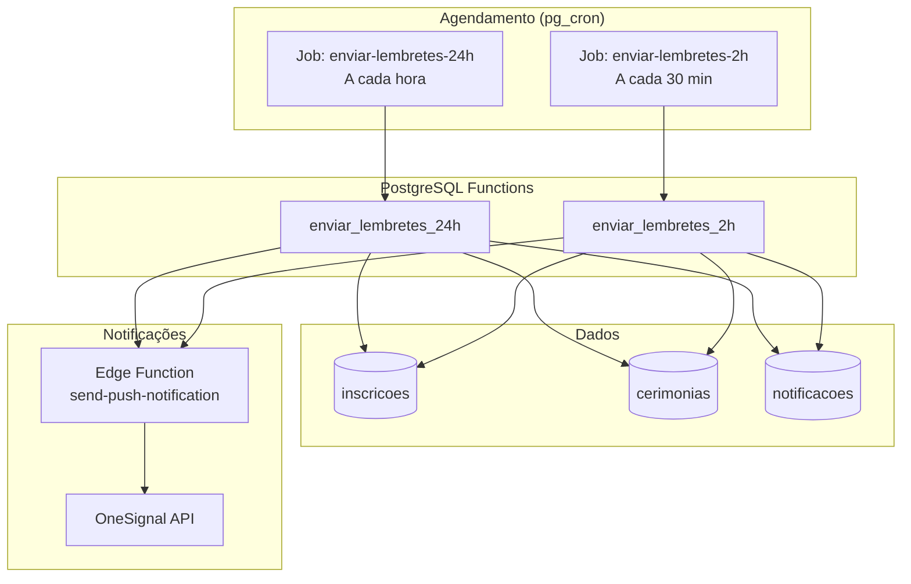
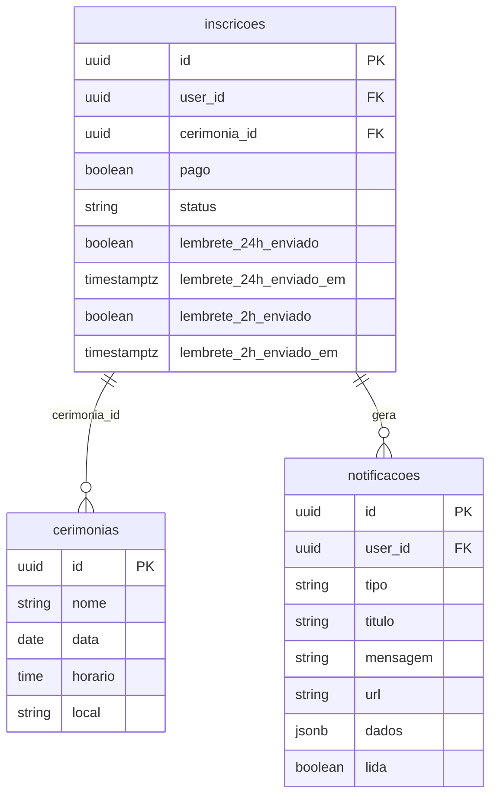

# Design Document - Lembretes Automáticos de Cerimônia

## Overview

Este documento descreve o design técnico para implementação de lembretes automáticos de cerimônia no Portal Consciência Divinal. O sistema enviará notificações push e in-app automaticamente para consagradores inscritos em cerimônias, com lembretes em dois momentos: 24 horas e 2 horas antes do evento.

A solução aproveita a infraestrutura existente de OneSignal para push notifications e pg_cron para agendamento de jobs, seguindo o padrão já estabelecido no projeto (ex: `enviar_convites_partilha`).

## Architecture



### Design Decisions

1. **Duas funções separadas vs uma função parametrizada**: Optamos por funções separadas (`enviar_lembretes_24h` e `enviar_lembretes_2h`) para maior clareza e facilidade de manutenção, seguindo o padrão existente.

2. **Campos de controle na tabela inscricoes**: Adicionamos campos booleanos e timestamps diretamente na tabela `inscricoes` para controle de envio, evitando tabela auxiliar e simplificando queries.

3. **Notificação dual (push + in-app)**: Cada lembrete gera tanto push notification quanto registro em `notificacoes`, garantindo que o usuário veja o lembrete mesmo sem push habilitado.

4. **Janelas de verificação**: Job de 24h executa a cada hora (janela 23-25h), job de 2h executa a cada 30 minutos (janela 1.5-2.5h), garantindo cobertura sem duplicatas.

## Components and Interfaces

### 1. Migration SQL

Adiciona campos de controle na tabela `inscricoes` e cria as funções e jobs pg_cron.

**Campos adicionados em `inscricoes`:**
- `lembrete_24h_enviado` (BOOLEAN)
- `lembrete_24h_enviado_em` (TIMESTAMPTZ)
- `lembrete_2h_enviado` (BOOLEAN)
- `lembrete_2h_enviado_em` (TIMESTAMPTZ)

### 2. Função `enviar_lembretes_24h()`

```sql
-- Pseudocódigo
FOR inscricao IN (
  SELECT inscrições confirmadas
  WHERE cerimônia entre 23 e 25 horas no futuro
    AND lembrete_24h_enviado = FALSE
    AND pago = TRUE
    AND status != 'cancelada'
)
LOOP
  -- Criar notificação in-app
  INSERT INTO notificacoes (...)
  
  -- Atualizar flag de envio
  UPDATE inscricoes SET lembrete_24h_enviado = TRUE, lembrete_24h_enviado_em = NOW()
  
  -- Enviar push via Edge Function
  PERFORM net.http_post(...)
END LOOP
```

### 3. Função `enviar_lembretes_2h()`

Similar à função de 24h, mas com:
- Janela de tempo: 1.5 a 2.5 horas
- Mensagem com tom de urgência
- Inclui local da cerimônia na mensagem

### 4. Jobs pg_cron

| Job | Schedule | Função |
|-----|----------|--------|
| `enviar-lembretes-24h` | `0 * * * *` (a cada hora) | `enviar_lembretes_24h()` |
| `enviar-lembretes-2h` | `*/30 * * * *` (a cada 30 min) | `enviar_lembretes_2h()` |

### 5. Integração com Edge Function Existente

Utiliza a Edge Function `send-push-notification` já existente, que aceita:
```typescript
interface PushNotificationRequest {
  userId: string;      // external_user_id do OneSignal
  title: string;
  message: string;
  url?: string;        // URL para abrir ao clicar
  data?: Record<string, string>;
}
```

## Data Models

### Alterações na tabela `inscricoes`

```sql
ALTER TABLE inscricoes ADD COLUMN IF NOT EXISTS
  lembrete_24h_enviado BOOLEAN DEFAULT FALSE,
  lembrete_24h_enviado_em TIMESTAMP WITH TIME ZONE,
  lembrete_2h_enviado BOOLEAN DEFAULT FALSE,
  lembrete_2h_enviado_em TIMESTAMP WITH TIME ZONE;
```

### Estrutura da notificação in-app

```sql
INSERT INTO notificacoes (
  user_id,
  tipo,           -- 'lembrete_cerimonia_24h' ou 'lembrete_cerimonia_2h'
  titulo,
  mensagem,
  url,            -- '/cerimonias/{id}'
  dados           -- { cerimonia_id, cerimonia_nome, inscricao_id }
)
```

### Diagrama ER (campos relevantes)




## Correctness Properties

*A property is a characteristic or behavior that should hold true across all valid executions of a system-essentially, a formal statement about what the system should do. Properties serve as the bridge between human-readable specifications and machine-verifiable correctness guarantees.*

### Property Reflection

Após análise dos critérios de aceitação, identificamos as seguintes redundâncias:
- 3.1 é redundante com 1.3 e 2.3 (atualização de campos)
- 3.3 é redundante com 1.4 e 2.4 (verificação antes de envio)
- 1.3 e 2.3 podem ser combinados em uma propriedade única sobre persistência
- 1.4 e 2.4 podem ser combinados em uma propriedade única sobre idempotência

### Properties

**Property 1: Janela de tempo 24h**
*For any* cerimônia e inscrição confirmada, quando a cerimônia está entre 23 e 25 horas no futuro e o lembrete de 24h ainda não foi enviado, a função `enviar_lembretes_24h` deve incluir essa inscrição no processamento.
**Validates: Requirements 1.1**

**Property 2: Janela de tempo 2h**
*For any* cerimônia e inscrição confirmada, quando a cerimônia está entre 1.5 e 2.5 horas no futuro e o lembrete de 2h ainda não foi enviado, a função `enviar_lembretes_2h` deve incluir essa inscrição no processamento.
**Validates: Requirements 2.1**

**Property 3: Conteúdo do lembrete 24h**
*For any* lembrete de 24h gerado, a mensagem deve conter o nome da cerimônia, a data e o horário.
**Validates: Requirements 1.2**

**Property 4: Conteúdo do lembrete 2h**
*For any* lembrete de 2h gerado, a mensagem deve conter indicação de urgência e o local da cerimônia.
**Validates: Requirements 2.2**

**Property 5: Persistência de flags de envio**
*For any* inscrição que recebe um lembrete (24h ou 2h), o campo correspondente (`lembrete_24h_enviado` ou `lembrete_2h_enviado`) deve ser TRUE e o timestamp correspondente deve ser não-nulo.
**Validates: Requirements 1.3, 2.3, 3.1, 3.2**

**Property 6: Idempotência de envio**
*For any* inscrição com `lembrete_24h_enviado = TRUE` ou `lembrete_2h_enviado = TRUE`, executar a função de lembretes correspondente não deve gerar nova notificação para essa inscrição.
**Validates: Requirements 1.4, 2.4, 3.3**

**Property 7: Filtragem de inscrições não confirmadas**
*For any* inscrição com `pago = FALSE` ou status cancelado, a função de lembretes não deve gerar notificação para essa inscrição.
**Validates: Requirements 3.4**

**Property 8: Completude de processamento**
*For any* conjunto de cerimônias elegíveis (dentro da janela de tempo), todas devem ser processadas em uma única execução do job.
**Validates: Requirements 4.3**

**Property 9: Notificação in-app criada**
*For any* lembrete enviado, deve existir um registro correspondente na tabela `notificacoes` com o `user_id` correto e tipo apropriado.
**Validates: Requirements 5.1**

**Property 10: URL de redirecionamento**
*For any* notificação de lembrete criada, o campo `url` deve apontar para a página de detalhes da cerimônia correspondente.
**Validates: Requirements 5.3**

## Error Handling

### Falhas no envio de push notification

1. **Erro de rede/timeout**: A função continua processando outras inscrições. O erro é logado mas não impede o registro da notificação in-app.

2. **Usuário sem OneSignal configurado**: O push falha silenciosamente, mas a notificação in-app é criada normalmente.

3. **Edge Function indisponível**: Utiliza `net.http_post` com timeout. Falha não bloqueia atualização dos flags.

### Estratégia de retry

- Não há retry automático para push notifications falhas
- A notificação in-app serve como fallback
- Logs são registrados para análise posterior

### Validações

```sql
-- Verificar se cerimônia existe e está no futuro
IF NOT EXISTS (SELECT 1 FROM cerimonias WHERE id = cerimonia_id AND data >= CURRENT_DATE) THEN
  CONTINUE; -- Pula inscrição inválida
END IF;
```

## Testing Strategy

### Framework de Testes

- **Property-Based Testing**: Vitest com `fast-check` para testes de propriedades
- **Unit Tests**: Vitest para testes unitários de funções auxiliares
- **Integration Tests**: Testes contra banco Supabase local

### Abordagem de Testes

#### Unit Tests
- Testar funções de formatação de mensagens
- Testar cálculo de janelas de tempo
- Testar queries de seleção de inscrições elegíveis

#### Property-Based Tests
- Cada propriedade definida acima será implementada como um teste PBT
- Usar `fast-check` para gerar dados aleatórios de cerimônias e inscrições
- Mínimo de 100 iterações por propriedade
- Formato de anotação: `**Feature: lembretes-automaticos, Property {number}: {property_text}**`

### Estrutura de Testes

```
src/
  lib/
    lembretes/
      __tests__/
        lembretes.test.ts        # Unit tests
        lembretes.property.ts    # Property-based tests
      formatters.ts              # Funções de formatação
      queries.ts                 # Queries de seleção
      types.ts                   # Tipos TypeScript
```

### Generators para PBT

```typescript
// Exemplo de generator para fast-check
const cermoniaArb = fc.record({
  id: fc.uuid(),
  nome: fc.string({ minLength: 1 }),
  data: fc.date({ min: new Date(), max: addDays(new Date(), 30) }),
  horario: fc.string().map(s => `${Math.floor(Math.random() * 24)}:00`),
  local: fc.string({ minLength: 1 })
});

const inscricaoArb = fc.record({
  id: fc.uuid(),
  user_id: fc.uuid(),
  cerimonia_id: fc.uuid(),
  pago: fc.boolean(),
  lembrete_24h_enviado: fc.boolean(),
  lembrete_2h_enviado: fc.boolean()
});
```
